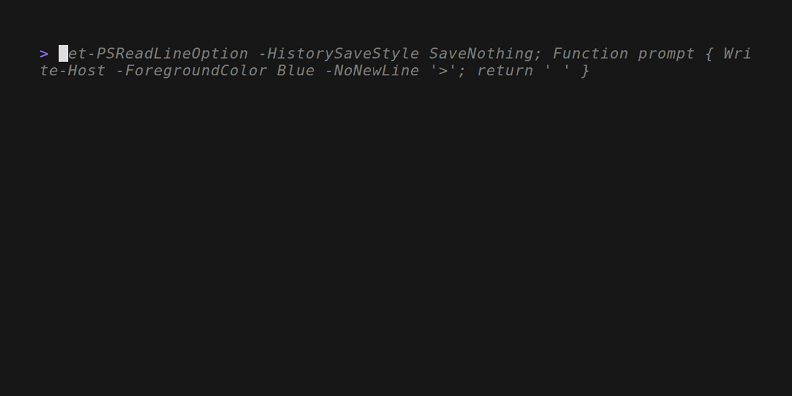

SeqLogger
=========

<!-- To publish to PowerShell Gallery, commit an update to the .psd1 file -->

Commands to send structured log events to a Seq server.

- [Send-SeqEvent](https://github.com/brianary/SeqLogger/wiki/Send-SeqEvent): Send an event to a Seq server.
- [Send-SeqScriptEvent](https://github.com/brianary/SeqLogger/wiki/Send-SeqScriptEvent): Sends an event (often an error) from a script to a Seq server, including script info.
- [Use-SeqServer](https://github.com/brianary/SeqLogger/wiki/Use-SeqServer): Set the default Server and ApiKey for Send-SeqEvent.ps1
